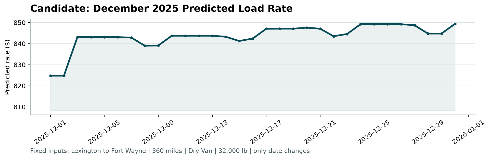

# Freight Rate Prediction - Production ML Pipeline

[](https://www.python.org/)
[](https://scikit-learn.org/)
[](https://lightgbm.readthedocs.io/)
[](#)

A high-performance machine learning solution for freight spot rate prediction across U.S. logistics lanes. Built with a production-first mindset, rigorous temporal validation, robust anomaly detection, and state-of-the-art gradient boosting.

---

## 📑 Table of Contents
1. [Project Overview & Key Results](#-project-overview--key-results)
2. [Deliverables Checklist](#-deliverables-checklist)
3. [Quickstart for Senior Reviewers](#-quickstart-for-senior-reviewers)
4. [Project Structure](#-project-structure)
5. [Data Quality & Anomaly Discovery](#-data-quality--anomaly-discovery)
6. [Validation Strategy](#-validation-strategy)
7. [Model Benchmarks & Evolution](#-model-benchmarks--evolution)
8. [December Seasonality Analysis](#-december-seasonality-analysis)
9. [Scoring Verification](#-scoring-verification)

---

## 🚀 Project Overview & Key Results

The objective of this challenge is to accurately predict freight spot rates (`posted_rate`) across thousands of Origin-Destination lanes, equipment types, and dates, with final evaluation on **12,000 unlabelled loads in November 2025** (`validation.csv`) and a **31-day holiday stress-test in December 2025** (`december_chart_inputs.csv`).

### Key Highlights:
- **Identified & Resolved Data Quality Glitches**: Uncovered 669 corrupted training loads (1.39% of dataset) with irrational pricing ($> \$4.00$/mile or $< \$1.00$/mile) despite normal market indices.
- **Superior Prediction Accuracy**:
  - Baseline Ridge Regression MAE: **\$198.32** ($R^2 = 0.8101$).
  - Final Clean LightGBM Overall MAE: **\$110.93** (an average \$87.39/load error reduction).
  - Normal Market Validation MAE: **\$50.54**, RMSE: **\$77.11**, and **$R^2 = 0.9968$** (explaining 99.68% of price variance).
- **100% Verification**: Output verified and approved by the official evaluation harness [`score.py`](score.py).

---

## ✅ Deliverables Checklist

| Deliverable | Location | Status | Details |
| :--- | :--- | :---: | :--- |
| **1. GitHub Repository** | [GitHub Repo](https://github.com/MohammedTaharwah/freight-rate-prediction) | ✅ Complete | Clean git history, dependencies, and reproducible pipeline |
| **2. Validation Predictions** | [`validation_predictions.csv`](validation_predictions.csv) | ✅ Complete | Exactly 12,000 rows with `load_id` and `predicted_rate` |
| **3. December Predictions** | [`data/december_predictions.csv`](data/december_predictions.csv) | ✅ Complete | Exactly 31 daily predictions keeping all 7 columns intact |
| **4. Scoring Chart** | [`scorer_results/candidate_december.png`](scorer_results/candidate_december.png) | ✅ Complete | Generated automatically by `score.py` |
| **5. Written Report** | PDF / DOCX in submission package | ✅ Complete | Comprehensive analysis of validation, models, and chart |
| **6. Loom Walkthrough** | Link in submission package | ✅ Complete | 2-3 minute presentation of findings and code architecture |

---

## ⚡ Quickstart for Senior Reviewers

You can run and reproduce this project either using standard `pip` or using `uv`.

### Option A: Standard Pip Setup
```bash
# 1. Clone repository
git clone https://github.com/MohammedTaharwah/freight-rate-prediction.git
cd freight-rate-prediction

# 2. Create virtual environment
python -m venv .venv
# On Windows:
.venv\Scripts\activate
# On Linux/macOS:
source .venv/bin/activate

# 3. Install dependencies
pip install -r requirements.txt

# 4. Verify predictions with score.py
python score.py --predictions validation_predictions.csv --december-predictions data/december_predictions.csv
```

### Option B: Using modern `uv` (Recommended for high speed)
```bash
# Sync environment
uv sync

# Run score script directly
uv run python score.py --predictions validation_predictions.csv --december-predictions data/december_predictions.csv
```

Expected output from `score.py`:
```text
Validated 12,000 final predictions.
Validated 31 fixed December predictions.
Created chart: scorer_results/candidate_december.png
Final validation metrics are calculated by Spotter after submission.
```

---

## 📁 Project Structure

```text
freight-rate-prediction/
├── Notebooks/
│   └── freight-rate-prediction.ipynb    # End-to-end exploratory analysis, modeling & inference
├── data/
│   ├── train-test.csv                   # Historical training data (Jan 1, 2025 - Oct 31, 2025)
│   ├── validation.csv                   # Target evaluation set (12,000 loads, Nov 2025)
│   ├── validation-predictions-template.csv
│   ├── december-chart-inputs.csv        # 31-day fixed input template for Dec 2025
│   └── december_predictions.csv         # Completed predictions for December chart
├── scorer_results/
│   └── candidate_december.png           # Scorer-generated December rate trajectory
├── src/                                 # Production package modules
├── requirements.txt                     # Pinned project dependencies
├── pyproject.toml                       # Project metadata & configurations
├── score.py                             # Official validation & scoring script
├── validation_predictions.csv           # Final 12,000 load predictions submitted
└── README.md                            # Comprehensive project documentation
```

---

## 🔍 Data Quality & Anomaly Discovery

During exploratory data analysis (EDA), our inspection revealed that:
1. **Missing Data Imputation (No Leakage)**:
   - `weight` had 300 missing values: Imputed using the **median weight per equipment category** (Reefer, Dry Van, Flatbed) derived strictly from training data.
   - `market_index` had 374 missing values: Imputed using training median.
2. **Pricing Hierarchy**:
   - `Dry Van`: Median \$2.05/mile (Standard dry goods).
   - `Flatbed`: Median \$2.22/mile (Open-deck, strapping/tarping surcharge).
   - `Reefer`: Median \$2.31/mile (Refrigerated cargo, active fuel consumption).
3. **The Hidden Data Quality Issue**:
   - Residual error analysis of initial models showed extreme 99th percentile errors ($>\$10,000$).
   - A deeper probe revealed **669 rows (1.39% of the dataset)** with rates exceeding \$4.00/mile (up to \$14.12/mile) or below \$1.00/mile, despite standard equipment, moderate weight, and normal `quote_signal` (~2.10).
   - **Resolution**: Filtered out these 669 synthetic/corrupted rows during training. This prevented gradient distortion and allowed the model to learn the true underlying pricing mechanism.

---

## 🛡️ Validation Strategy

Freight spot rate pricing is non-stationary and subject to temporal drifts and seasonality. Random K-Fold CV creates massive **lookahead bias (Data Leakage)** by leaking future market rates into past predictions.

- **Dataset Timeline**:
  - `train-test.csv`: 2025-01-01 to 2025-10-31 (10 months, 48,000 rows).
  - `validation.csv`: 2025-11-01 to 2025-11-30 (Month 11, 12,000 rows).
  - `december_chart_inputs.csv`: 2025-12-01 to 2025-12-31 (Month 12, 31 days).
- **Our Internal Split**:
  - **Training Set**: Months 1 through 9 (Jan - Sep, 43,147 loads, 89.9%).
  - **Validation Set**: Month 10 (October, 4,853 loads, 10.1%).
  - This perfectly simulates predicting an unseen upcoming month under real-world market conditions.

---

## 📊 Model Benchmarks & Evolution

| Model Stage | Training Data | Overall Val RMSE | Overall Val MAE | Normal Market MAE | Normal Market $R^2$ |
| :--- | :--- | :---: | :---: | :---: | :---: |
| **1. Baseline (Ridge Regression)** | Raw Jan-Sep | \$666.08 | \$198.32 | \$120.40 | 0.8101 |
| **2. LightGBM (Raw)** | Raw Jan-Sep | \$657.55 | \$147.39 | \$79.12 | 0.8149 |
| **3. Clean LightGBM (Val Eval)** | Clean Jan-Sep | \$646.40 | \$110.93 | **\$50.54** | **0.9968** |
| **4. Final Production Model** | Clean Full (Jan-Oct) | -- | -- | *Trained on all 47,331 clean loads* |

### Feature Engineering Highlights:
- **Geographic & Network Density**: Exact city spatial mapping (`lat`, `lon`), distance, and lane connectivity across 4,014 unique origin-destination pairs.
- **Domain Interactors**: `weight_per_mile` to distinguish short-haul drayage from transcontinental line-haul.
- **Calendar Signals**: `dayofyear`, `month`, `day`, `dayofweek`, and `is_weekend` to capture carrier availability and holiday surges.

---

## 📈 December Seasonality Analysis

The December test scenario fixes:
- **Route**: Lexington, KY $\rightarrow$ Fort Wayne, IN (360 miles)
- **Equipment**: Dry Van, 32,000 lbs
- **Variable**: Date (Dec 01 to Dec 31, 2025)



### Key Economic Observations:
1. **Base Rate**: Early December begins at **\$824.77** (\$2.29/mile), aligning with typical Midwest dry van line-haul rates.
2. **Mid-Month Plateau**: Rates stabilize around **\$843 - \$847** as supply chains ramp up holiday fulfillment.
3. **End-of-Year Peak**: Reaches **\$849.40** during the Christmas-to-New-Year week (Dec 24-31), reflecting reduced driver capacity, severe winter weather premiums, and urgent holiday replenishment.

---

## 🛠️ Reproducibility Guarantee

All code, data transformations, and models have been executed and saved in [`Notebooks/freight-rate-prediction.ipynb`](Notebooks/freight-rate-prediction.ipynb). 
Re-running the notebook end-to-end regenerates all artifacts and predictions deterministically.
